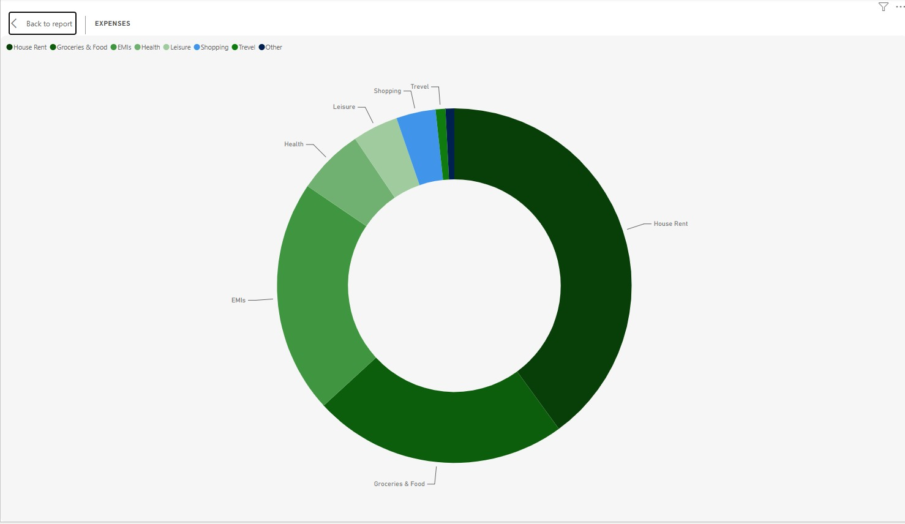
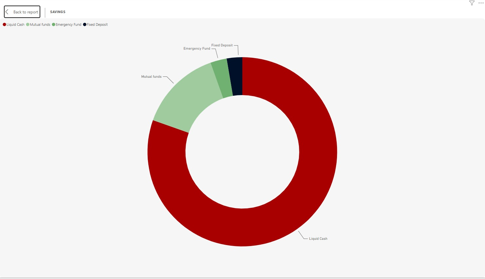
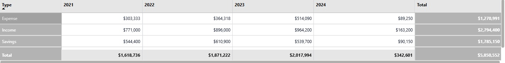

# 💰 Finance Dashboard , Personal Financial Analysis

An interactive dashboard for analyzing personal income, expenses, and savings over time , built to turn raw monthly financial data into clear, actionable insights.


---

## 📌 Overview

This project focuses on building an interactive **Finance Dashboard** to analyze income, expenses, savings, and financial trends over time. It transforms a monthly financial dataset into a clear visual report, making it easier to monitor financial performance, understand spending patterns, and track savings.

The analysis covers **January 2021 to February 2024** and categorizes financial activity into three core groups: **Income**, **Expenses**, and **Savings**.

---

## 🎯 Objective

The dashboard was built to provide a centralized view that answers key financial questions, such as:

- How much income was generated over the period?
- How much was spent on expenses?
- How much money was saved?
- What percentage of income was saved?
- How have expenses changed over time?
- What are the major expense categories?
- How are savings distributed across different savings instruments?
- How does financial performance vary from year to year?

---

## 🗂️ Dataset

The dataset contains **15 financial records across 40 columns**, including monthly financial values from January 2021 to February 2024, broken down by type and component.

| Category | Components |
|---|---|
| **Income** | Salary, Freelancing |
| **Expenses** | House Rent, Groceries & Food, EMIs, Health, Leisure, Shopping, Travel |
| **Savings** | Liquid Cash, Mutual Funds, Emergency Fund, Fixed Deposit |

---

## 📊 Dashboard Features

### KPI Cards
A top-level summary of the overall financial position:

| Metric | Value |
|---|---|
| Savings % | **63.88%** |
| Total Expenses | **$1.27M** |
| Total Value | **$6M** |
| Total Savings | **$1.79M** |

### Expenses Trend
A line chart tracking how expenses changed from 2021 through 2024, making it easy to spot periods of rising or falling expenditure and unusual spending activity.


### Expense Distribution
A donut chart breaking down expenses by category (House Rent, Groceries & Food, EMIs, Health, Leisure, Shopping, Travel), highlighting where most money is spent.



### Savings Distribution
A donut chart showing how savings are allocated across Liquid Cash, Mutual Funds, Emergency Fund, and Fixed Deposit.



### Year Filters
Interactive filters for 2021, 2022, 2023, and 2024, enabling year-by-year comparison.


### Financial Summary Table
An annual summary table of Income, Expenses, and Savings values.


---

## 🔍 Key Insights

- Total recorded **expenses** are approximately **$1.27M**.
- Total **savings** are approximately **$1.79M**.
- Total **income** is approximately **$2.79M** over the analyzed period.
- The dashboard reports a **63.88% savings rate**.
- Expenses fluctuate considerably over the period, with notable changes around **late 2022 and early 2023**.
- Housing, groceries, EMIs, and other recurring categories contribute significantly to overall expenditure.
- Savings are spread across liquid cash, mutual funds, emergency funds, and fixed deposits.

| Type | 2021 | 2022 | 2023 | 2024 | Total |
|---|---|---|---|---|---|
| Expense | $303,333 | $364,318 | $514,090 | $89,250 | $1,270,991 |
| Income | $771,000 | $896,000 | $964,200 | $163,200 | $2,794,400 |
| Savings | $544,400 | $610,900 | $539,700 | $90,150 | $1,785,150 |

---

## 🛠️ Tools & Skills Demonstrated

- Excel
- Data cleaning and transformation
- Data modeling
- Financial analysis
- KPI development
- Data visualization
- Dashboard design
- Interactive filtering
- Trend analysis
- Business/financial storytelling

---

## ✅ Project Outcome

The final dashboard converts a monthly financial dataset into an interactive financial reporting tool. Instead of reviewing individual monthly figures, users can quickly understand their income, spending, savings, and financial trends through KPIs, charts, filters, and summary tables.

---

## 📁 Repository Structure

```
├── images/                  # Dashboard screenshots used in this README
├── README.md                # Project documentation
└── (dataset & dashboard file)
```

---

## 📬 Contact

Feel free to reach out with questions, feedback, or collaboration ideas.
